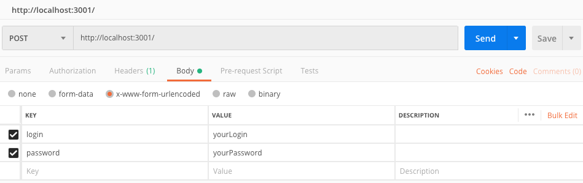

# Getting Started:
`npm install`

Before launching, make sure that you have installed Node.js

# Launching: 
`npm start`

# How to work with it
Do a post request to the root endpoint with login and password fields in body.
By default, app will launch on 3001 port, so if you launch it locally just do a post request to http://localhost:3001/.
You can use Postman app for it. Here is an example:

To check results after response, see the screenshots folder. There will be initialScreenshot.png - just main page before events,
loginScreenshot - page with modal window after typing login and password, and finalScreenshot - page after pressing the login button. 
